<div align="center">

# HERCULES

### An Open-Source Simulation Framework for Heterogeneous Multi-Robot SLAM, Collaborative Perception, and Exploration

**[Sandilya Sai Garimella](#)<sup>1</sup> · [Daniel Chase Butterfield](#)<sup>1</sup> · [Sean Wilson](#)<sup>1,2</sup> · [Lu Gan](#)<sup>1</sup>**

<sup>1</sup>Georgia Institute of Technology · <sup>2</sup>Georgia Tech Research Institute

[](https://arxiv.org/abs/2606.22756)
[](https://github.com/lunarlab-gatech/HERCULES)
[](https://www.youtube.com/watch?v=Is3MmmMx2fw)
[](https://huggingface.co/datasets/GeorgiaTech/HERCULES)
[](https://www.unrealengine.com/)
[](https://docs.ros.org/en/humble/)
[](LICENSE)

*An open-source Unreal Engine 5 simulator for heterogeneous UAV–UGV teams in photorealistic, dynamic, large-scale environments.*

</div>

---

## Overview

**HERCULES** is a simulation platform for heterogeneous multi-robot autonomy that lets unmanned ground vehicles (UGVs) and unmanned aerial vehicles (UAVs) **collaboratively explore and understand large-scale, complex environments**. Built as an advanced fork of [AirSim](https://github.com/microsoft/AirSim) / [Cosys-AirSim](https://github.com/Cosys-Lab/Cosys-AirSim) on **Unreal Engine 5**, it provides a unified autonomy pipeline for concurrent UAV–UGV operation, high-fidelity sensing, and large-scale environmental interaction — including offline trajectory generation, kinodynamically feasible motion for both platforms, and complementary coverage and leader–follower patterns for dataset collection.

A novel autonomous waypoint-tracking UGV controller mirrors the UAV interface, enabling unified high-level research in exploration and multi-robot coordination. As a benchmark sandbox, HERCULES ships ready-to-run baselines for **collaborative SLAM** ([ROMAN](https://github.com/mit-acl/ROMAN)) and **collaborative perception** ([DAIR-V2X](https://github.com/AIR-THU/DAIR-V2X)-style multi-view 3D detection). Optimized ROS 2 wrappers and lightweight APIs let you develop SLAM, perception, and learning-based algorithms directly on top of the infrastructure.

<div align="center">
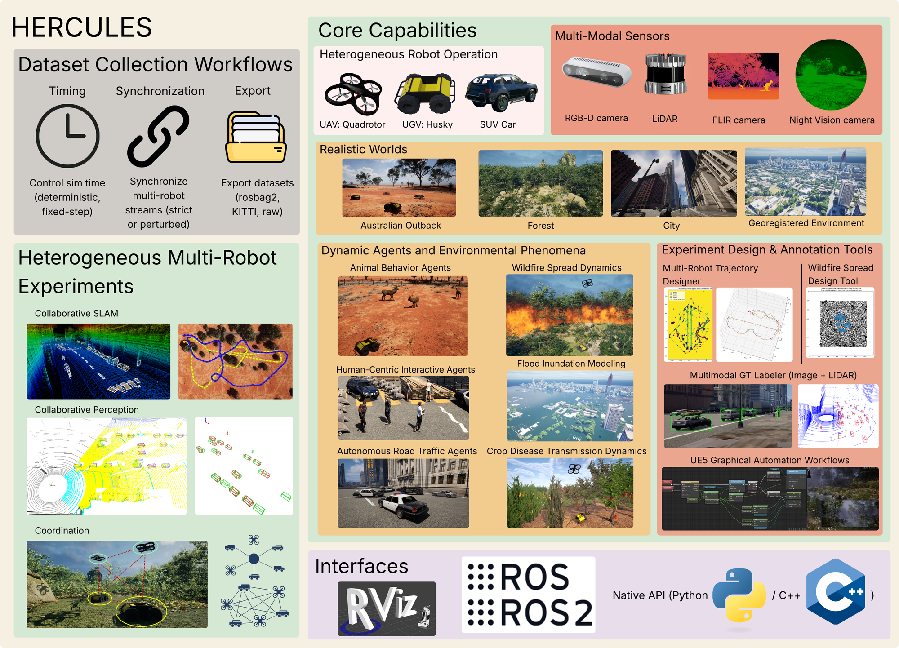
</div>

### Highlights

- **Integrated heterogeneous autonomy stack.** We re-architect the AirSim/Cosys-AirSim SimMode layer to enable **concurrent UAV–UGV operation within a single simulation session**, resolving a fundamental physics-engine conflict that previously restricted each session to one vehicle type. On top of it: a unified waypoint-level command interface, an autonomous UGV controller, an end-to-end planning pipeline, and coordinated multi-robot sensor logging.
- **New sensor modalities & dynamic environments.** Two sensors not in Cosys-AirSim — a **long-wave infrared (LWIR)** thermal camera based on Planck-law spectral radiance, and a **night-vision (NVG)** camera with empirical photometric transfer. Parameterized dynamic-environment modules (**wildfire spread, flood inundation, crop-disease transmission**) and dynamic-agent Blueprints (MetaHuman pedestrians, VehicleAI traffic, AnimalAI wildlife) update the shared world state at runtime.
- **Open benchmarks & reproducible release.** Evaluation suites for collaborative SLAM (ROMAN) and multi-view 3D object detection (DAIR-V2X-style), a dataset-collection pipeline exporting synchronized multimodal data in standard formats (KITTI-style layouts, ROS 2 bags), and performance-optimized ROS 2 wrappers for direct integration with existing autonomy stacks.

---

## Table of Contents

- [Getting Started](#getting-started)
- [Environments](#environments)
- [Sensors & Phenomena](#sensors--phenomena)
- [Collaborative SLAM](#collaborative-slam)
- [Cooperative Perception](#cooperative-perception)
- [Multimodal Dataset](#multimodal-dataset)
- [Dataset](#dataset)
- [Roadmap](#roadmap)
- [Citation](#citation)
- [Acknowledgements](#acknowledgements)
- [License](#license)

---

## Getting Started

HERCULES is developed and tested on **Ubuntu 22.04** with **Unreal Engine 5.2.1** and **ROS 2 Humble**. It is distributed as an Unreal plugin that drops into an Unreal environment, plus lightweight Python and ROS 2 clients.

### Requirements

| Component | Version / Notes |
|---|---|
| OS | Ubuntu 22.04 (Linux); Windows also supported for the simulator |
| Unreal Engine | **5.2.1** (source build recommended — [get UE from Epic](https://www.unrealengine.com/en-US/download)) |
| Toolchain | clang-12, CMake ≥ 3.12 (installed by `setup.sh`) |
| Python | 3.10 (see [`PythonClient/requirements-herculesvenv.txt`](PythonClient/requirements-herculesvenv.txt)) |
| ROS 2 | Humble (for the ROS 2 wrappers) |

### 1. Clone

```bash
git clone https://github.com/lunarlab-gatech/HERCULES.git
cd HERCULES
```

### 2. Build the plugin

`setup.sh` fetches dependencies (rpclib, Eigen) and toolchain; `build.sh` compiles the AirLib libraries and the Unreal plugin.

```bash
./setup.sh
./build.sh
```

### 3. Run the simulator

The build produces the `Cosys-AirSim` Unreal plugin. Drop it into an Unreal environment and open the project with **UE 5.2.1**. Two ready environments are included under [`Unreal/Environments/`](Unreal/Environments/): **`Blocks`** (minimal) and **`DynamicObjects`**. Detailed steps — including running from a packaged binary — are in the docs:

- [Install & build on Linux](docs/install_linux.md) · [on Windows](docs/install_windows.md)
- [Run a precompiled/packaged build](docs/install_precompiled.md)
- [Simulation settings (`settings.json`)](docs/settings.md) — place your config at `~/Documents/AirSim/settings.json`

### 4. Python client

The Python API is packaged as **`hercules_cosysairsim`** (importable as `hercules_cosysairsim`, distributed as `hercules-cosys-airsim`). Recreate the reference environment:

```bash
python3 -m venv herculesvenv
source herculesvenv/bin/activate
pip install -r PythonClient/requirements-herculesvenv.txt

# scripts locate the package via each folder's setup_path.py — just run one:
cd PythonClient/car && python hello_car.py
```

See [`PythonClient/README.md`](PythonClient/README.md) for details.

### 5. ROS 2 workspace

Performance-optimized ROS 2 (Humble) wrappers live under [`ros2/`](ros2/). Build with `colcon` and see [the ROS 2 C++ docs](docs/ros_cplusplus.md):

```bash
source /opt/ros/humble/setup.bash
cd ros2
colcon build
source install/setup.bash
```

---

## Environments

HERCULES ships with three photorealistic worlds — **desert, forest, and city** — each engineered to stress a different class of perception and planning failure: sparse landmarks and long-range visibility (desert), perceptual aliasing from repetitive geometry (forest), and dense occlusions with dynamic agents (city). Georeferenced real-world scenes can be imported via [Cesium for Unreal](https://cesium.com/platform/cesium-for-unreal/).

<table>
<tr>
<td width="50%"><br><sub><b>Australian Outback — Wildlife.</b> Kangaroos roaming the outback world.</sub></td>
<td width="50%">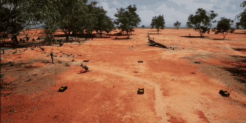<br><sub><b>Australian Outback — UAV + UGV.</b> Heterogeneous team traversing the outback.</sub></td>
</tr>
<tr>
<td width="50%">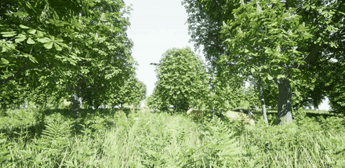<br><sub><b>Forest — Wildlife.</b> Deer in the forest world.</sub></td>
<td width="50%"><br><sub><b>Forest — UAV + UGV.</b> Heterogeneous team traversing the forest.</sub></td>
</tr>
<tr>
<td width="50%"><br><sub><b>City — Traffic.</b> Vehicle traffic through the urban world.</sub></td>
<td width="50%"><br><sub><b>City — UAV + UGV.</b> Heterogeneous team traversing the city.</sub></td>
</tr>
</table>

---

## Sensors & Phenomena

Beyond the inherited Cosys-AirSim sensor suite (RGB, depth, semantic segmentation, LiDAR, GPU-LiDAR, echo/radar, IMU, GPS…), HERCULES adds **physics-based LWIR thermal** and **night-vision** cameras, plus three classes of dynamic environmental phenomena that update the shared world state at runtime.

### New Sensor Modalities

<table>
<tr>
<td width="50%"><br><sub><b>Night-Vision (NVG).</b> Low-light photometric transfer, desert scene.</sub></td>
<td width="50%"><br><sub><b>LWIR Thermal.</b> Planck-law spectral radiance — kangaroos near a fire read hot.</sub></td>
</tr>
</table>

### Dynamic Environmental Phenomena

<table>
<tr>
<td width="50%">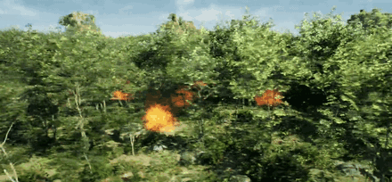<br><sub><b>Wildfire Spread.</b> Fire propagating through a forest environment.</sub></td>
<td width="50%">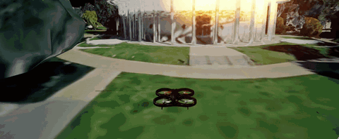<br><sub><b>Pasadena Fire.</b> Fire over a Cesium 3D model of Pasadena, from a UAV at night.</sub></td>
</tr>
<tr>
<td width="50%">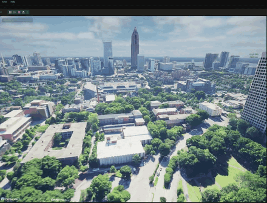<br><sub><b>Atlanta Flood.</b> Flood inundation over a Cesium 3D model of Atlanta.</sub></td>
<td width="50%">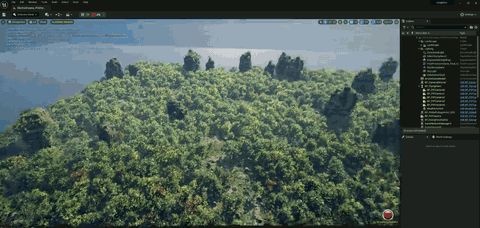<br><sub><b>Jungle Flood.</b> Flood inundation in a dense jungle environment.</sub></td>
</tr>
<tr>
<td width="50%"><br><sub><b>Crop Disease.</b> Disease transmission across agricultural terrain (still).</sub></td>
<td width="50%"></td>
</tr>
</table>

**Download & use the custom Blueprints** — each phenomenon ships as a parameterized Unreal Blueprint you can drop into your own project:

<div align="center">

[](https://lunarlab-gatech.github.io/HERCULES/blueprint_wildfire/)
[](https://lunarlab-gatech.github.io/HERCULES/blueprint_flood/)
[](https://lunarlab-gatech.github.io/HERCULES/blueprint_crop_disease/)

</div>

---

## Collaborative SLAM

We benchmark [**ROMAN**](https://github.com/mit-acl/ROMAN) collaborative SLAM on a *City Block* sequence with **two UAVs and two UGVs**. Each robot runs LIO-SAM odometry with an open-set ROMAN object map; inter-robot loop closures are registered pairwise via [CLIPPER](https://github.com/mit-acl/clipper).

### Live Mapping

<table>
<tr>
<td width="50%">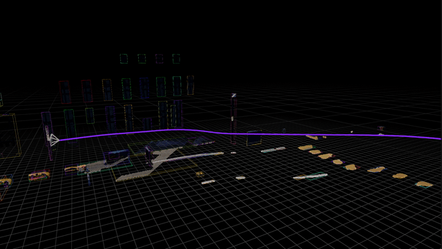<br><sub><b>UAV 1.</b> Live trajectory, camera pose, and object map.</sub></td>
<td width="50%">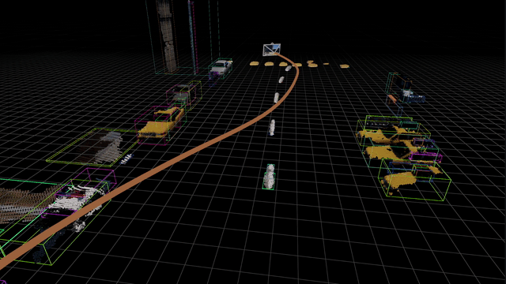<br><sub><b>UAV 2.</b> Live trajectory, camera pose, and object map.</sub></td>
</tr>
<tr>
<td width="50%">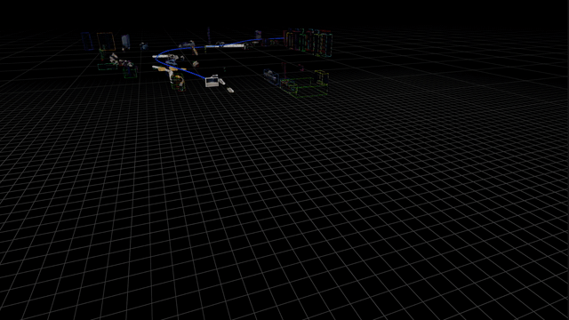<br><sub><b>UGV 1 (Husky).</b> Live trajectory, camera pose, and object map.</sub></td>
<td width="50%">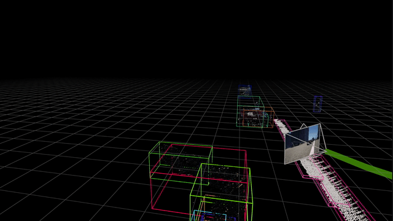<br><sub><b>UGV 2 (Husky).</b> Live trajectory, camera pose, and object map.</sub></td>
</tr>
</table>

### Final Maps

<table>
<tr>
<td width="50%">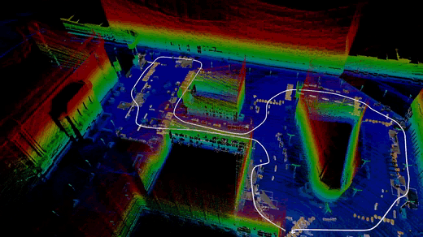<br><sub><b>UAV 1.</b> LIO-SAM final map with ROMAN object map.</sub></td>
<td width="50%">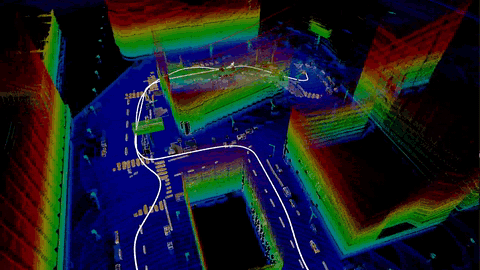<br><sub><b>UAV 2.</b> LIO-SAM final map with ROMAN object map.</sub></td>
</tr>
<tr>
<td width="50%">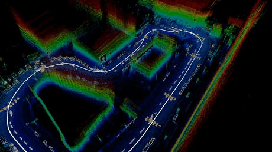<br><sub><b>UGV 1.</b> LIO-SAM final map with ROMAN object map.</sub></td>
<td width="50%">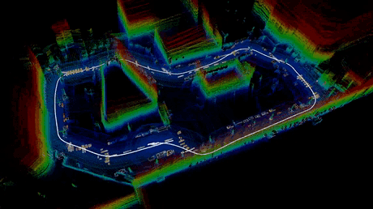<br><sub><b>UGV 2.</b> LIO-SAM final map with ROMAN object map.</sub></td>
</tr>
</table>

### Loop-Closure Alignment

<div align="center">
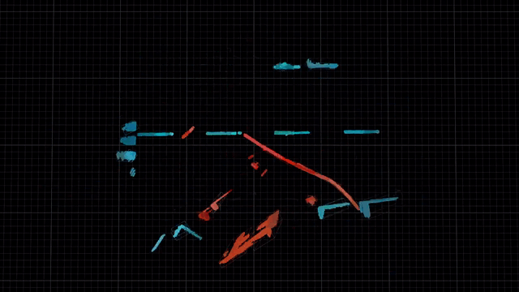<br>
<sub><b>ROMAN loop closure.</b> UGV 1 and UGV 2 submaps aligned pairwise via CLIPPER.</sub>
</div>

---

## Cooperative Perception

HERCULES supports **V2X-style collaborative perception**: a **vehicle-side** agent (a UGV on the sidewalk) and an **infrastructure-side** agent (an overhead UAV) observe a shared city intersection from complementary viewpoints. Each exports time-synchronized RGB and LiDAR, providing the overlapping multi-view coverage that cooperative detection and fusion methods rely on.

<div align="center">
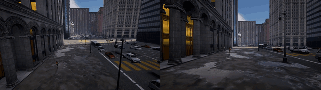<br>
<sub><b>Cooperative RGB.</b> Shared intersection from the vehicle-side UGV (left) and infrastructure-side UAV (right).</sub>
</div>

<table>
<tr>
<td width="50%">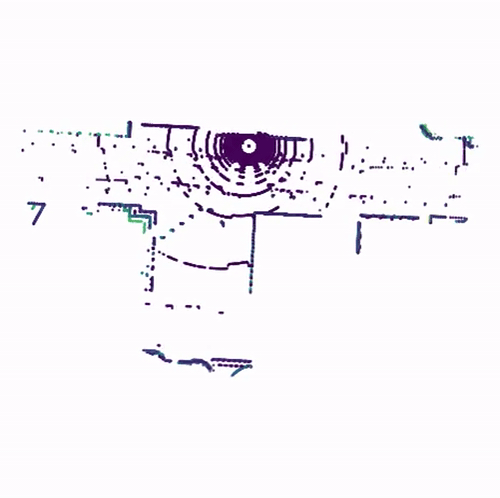<br><sub><b>Vehicle-Side LiDAR.</b> Point cloud from the UGV on the sidewalk.</sub></td>
<td width="50%">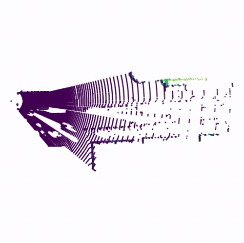<br><sub><b>Infrastructure-Side LiDAR.</b> Point cloud from the UAV overhead.</sub></td>
</tr>
<tr>
<td width="50%">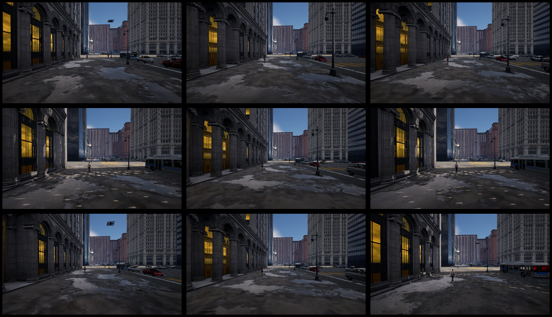<br><sub><b>Vehicle-Side RGB.</b> Sampled across the sequence.</sub></td>
<td width="50%">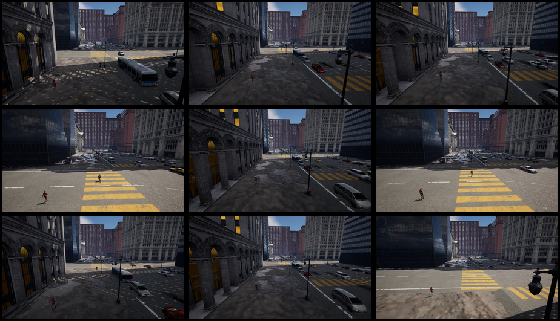<br><sub><b>Infrastructure-Side RGB.</b> Sampled across the sequence.</sub></td>
</tr>
<tr>
<td width="50%">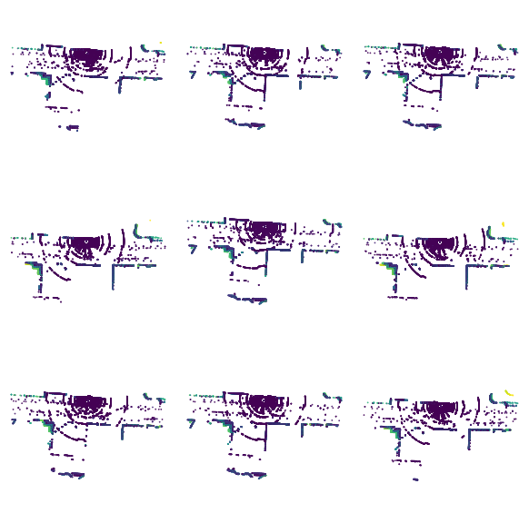<br><sub><b>Vehicle-Side LiDAR.</b> Sampled across the sequence.</sub></td>
<td width="50%">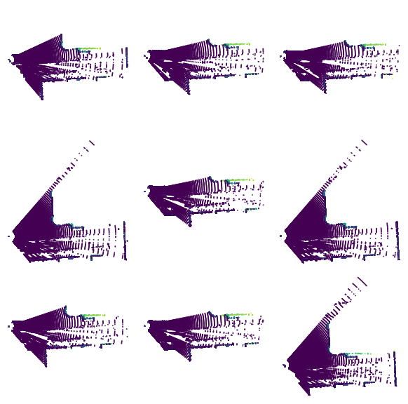<br><sub><b>Infrastructure-Side LiDAR.</b> Sampled across the sequence.</sub></td>
</tr>
</table>

---

## Multimodal Dataset

HERCULES exports **time-synchronized multimodal data** for heterogeneous robot teams. Each dashboard shows, per robot, the **RGB**, **depth**, **semantic segmentation**, and **LiDAR** streams captured along a coverage or leader–follower trajectory.

<table>
<tr>
<td width="50%">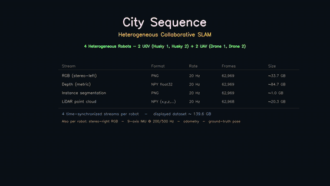<br><sub><b>City Block.</b> Urban sequence — RGB, depth, semantic, LiDAR per robot.</sub></td>
<td width="50%">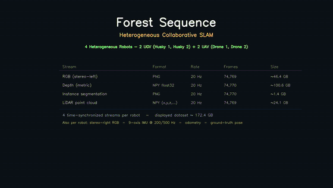<br><sub><b>Forest.</b> Forest sequence — RGB, depth, semantic, LiDAR per robot.</sub></td>
</tr>
<tr>
<td width="50%">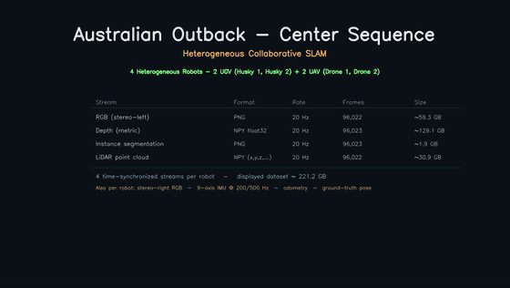<br><sub><b>Australia — Center Coverage.</b> Coverage trajectory across the team.</sub></td>
<td width="50%">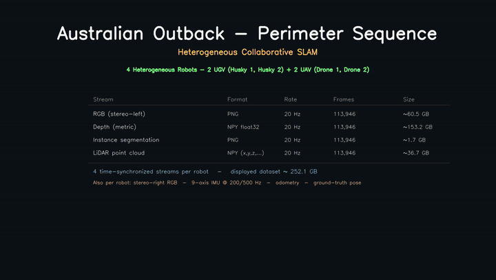<br><sub><b>Australia — Perimeter Coverage.</b> Perimeter trajectory across the team.</sub></td>
</tr>
</table>

---

## Dataset

Time-synchronized, multimodal sequences (RGB, depth, semantic segmentation, LiDAR, poses) for heterogeneous UAV–UGV teams across the desert, forest, and city worlds are hosted on Hugging Face:

**➡️ [huggingface.co/datasets/GeorgiaTech/HERCULES](https://huggingface.co/datasets/GeorgiaTech/HERCULES)**

Data is exported in standard formats (KITTI-style layouts and ROS 2 bags) via the built-in dataset-collection pipeline.

---

## Roadmap

HERCULES is under active development — here's what's in progress and coming next:

- [ ] **Custom phenomenon Blueprints** — publish the downloadable wildfire, flood, and crop-disease Blueprints (the linked pages above are placeholders for now).
- [ ] **Collaborative SLAM benchmark** — release the ROMAN evaluation scripts and configs.
- [ ] **Cooperative perception baselines** — release the DAIR-V2X-style multi-view 3D detection code.
- [ ] **Multimodal dataset** — upload the full desert / forest / city sequences to Hugging Face.
- [ ] **Sensor setup docs** — expand the LWIR and night-vision configuration and parameter references.
- [ ] **Additional dynamic agents & environments** — more MetaHuman / VehicleAI / AnimalAI presets.

Suggestions or bugs? [Open an issue](https://github.com/lunarlab-gatech/HERCULES/issues).

---

## Citation

If you use HERCULES in your research, please cite:

```bibtex
@misc{garimella2026hercules,
  title         = {HERCULES: An Open-Source Simulation Framework for Heterogeneous Multi-Robot SLAM, Collaborative Perception, and Exploration},
  author        = {Garimella, Sandilya Sai and Butterfield, Daniel Chase and Wilson, Sean and Gan, Lu},
  year          = {2026},
  eprint        = {2606.22756},
  archivePrefix = {arXiv},
  primaryClass  = {cs.RO},
  url           = {https://arxiv.org/abs/2606.22756}
}
```

---

## Acknowledgements

HERCULES builds on the shoulders of excellent open-source work:

- [**AirSim**](https://github.com/microsoft/AirSim) (Microsoft) — the original high-fidelity simulator this project extends.
- [**Cosys-AirSim**](https://github.com/Cosys-Lab/Cosys-AirSim) (Cosys-Lab, University of Antwerp) — the UE5 fork that adds annotation, instance segmentation, GPU-LiDAR, echo/radar, skid-steer vehicles, and more, which HERCULES is built upon.
- [**ROMAN**](https://github.com/mit-acl/ROMAN) & [**CLIPPER**](https://github.com/mit-acl/clipper) (MIT-ACL) — collaborative SLAM and robust registration baselines.
- [**DAIR-V2X**](https://github.com/AIR-THU/DAIR-V2X) — cooperative perception benchmark design.
- [**Cesium for Unreal**](https://cesium.com/platform/cesium-for-unreal/) — georeferenced real-world 3D environments.

Developed at [**LunarLab**](https://sites.gatech.edu/lunarlab/), Georgia Institute of Technology.

## License

Released under the **MIT License** — see [LICENSE](LICENSE). The original [AirSim MIT license](https://github.com/microsoft/AirSim/blob/main/LICENSE) applies to all native AirSim source files, and the same license covers modifications by Cosys-Lab and by LunarLab.
