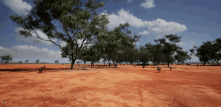

# Animal Behavior Blueprint

The **Animal Behavior** Blueprint is a custom, parameterized Unreal Engine Blueprint (AnimalAI) that populates a world with wildlife — kangaroos, deer, and other animals — that roam and react at runtime. This page covers how to download it and use it in your own Unreal project.



## Download

!!! note "Package being finalized"
    The Animal Behavior Blueprint will be published as a Blueprint package on the [HERCULES releases page](https://github.com/lunarlab-gatech/HERCULES/releases). Until the zip lands, this page already documents the requirements, install procedure, and sensor integration.
<!-- TODO: replace with the actual release asset link once published -->

The package contains the HERCULES-authored behavior Blueprints (spawner, AnimalAI logic, animation Blueprints where self-made) only. The animal meshes, skeletons, and animation packs are third-party marketplace content — **linked, not shipped** — see [Using Blueprint Packages](blueprint_packages.md).

## Requirements

| Requirement | Notes |
|---|---|
| Unreal Engine 5.2.1 | Version HERCULES is built against |
| HERCULES AirSim plugin | For sensing integration ([install](install_precompiled.md)) |
| Animal asset pack(s) | Per species — e.g. the [Animal Variety Pack](https://www.fab.com/search?q=animal%20variety%20pack) (deer) and a kangaroo model pack are used in the HERCULES AustraliaLandscape world. Assign the skeletal mesh / AnimBP per species via the Blueprint's exposed slots. |
| NavMesh in your level | Animals navigate with Unreal's navigation system — add a `NavMeshBoundsVolume` covering the roam area |

<!-- TODO: confirm final third-party asset list + expected content paths when the package is cut -->

## Install into your Unreal project

Follow the general steps in [Using Blueprint Packages](blueprint_packages.md#installing-a-package):

1. Download and unzip the Blueprint package, and copy the contained folder into your project's `Content/`.
2. Install the animal asset pack(s) for the species you want from their store links.
3. Restart the Unreal Editor, open the species Blueprints, and assign the skeletal mesh and animation Blueprint slots.
4. Make sure your level has a NavMesh covering the intended roam area.

## Usage

1. Place the animal spawner / behavior Blueprint into your level.
2. Choose the species and configure herd size, roam area, and behavior.
3. Play / run the simulation — the animals move through the world and are observable by all robots' sensors.

## Parameters

<!-- TODO: fill in the real exposed parameters from the packaged Blueprint -->
| Parameter | Description | Default |
|---|---|---|
| Species | Which animal(s) to spawn | — |
| Count / density | How many animals | — |
| Roam area | Region the animals wander | — |

## Sensor integration

Animals are the flagship targets for the [synthetic thermal camera](synthetic_cameras.md):

* Spawned animals must be registered with [instance segmentation](instance_segmentation.md) (`AddNewActorToSegmentation` on spawn — see [Using Blueprint Packages](blueprint_packages.md#making-blueprints-visible-to-the-hercules-sensors)); only skeletal/static meshes are supported.
* **Mesh naming matters**: names containing `kangaroo`, `deer`, or `animal` are classified as warm bodies (315 K, brightness-floored) by the [LWIR camera](lwir_camera.md); kangaroos additionally get the orange highlight recolor. Name your spawned instances accordingly (e.g. `BP_Kangaroo23`).
* Other species need only an override — no renaming:

```json
"SyntheticCameraSettings": {
  "ThermalIR": { "Overrides": [ { "Match": "elephant", "TempK": 309.0, "Emissivity": 0.98, "IsAnimal": true } ] }
}
```

See the [Dynamic Environmental Phenomena](dynamic_phenomena.md) overview and the [Environments](index.md#environments) for these agents in context.
