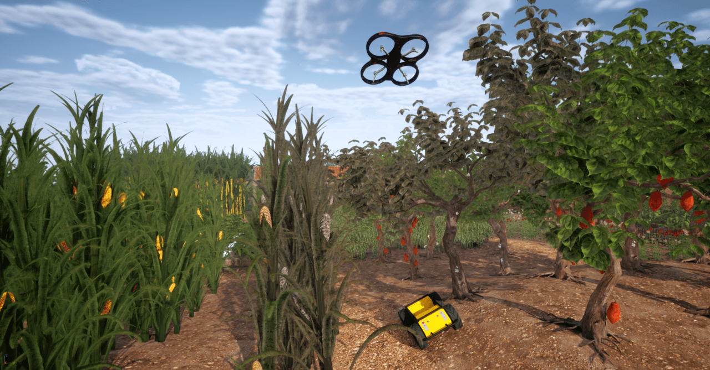

# Crop Disease Blueprint

The **Crop Disease** Blueprint is a custom, parameterized Unreal Engine Blueprint that simulates disease transmission spreading across agricultural terrain at runtime — driving precision-agriculture and monitoring scenarios. This page covers how to download it and use it in your own Unreal project.

## Download

!!! note "Package being finalized"
    The Crop Disease Blueprint will be published as a Blueprint package on the [HERCULES releases page](https://github.com/lunarlab-gatech/HERCULES/releases). Until the zip lands, this page already documents the requirements, install procedure, and sensor integration.
<!-- TODO: replace with the actual release asset link once published -->

The package contains the HERCULES-authored Blueprints and support assets (disease-state materials where self-made) only; third-party crop/terrain assets are linked, not shipped — see [Using Blueprint Packages](blueprint_packages.md).

## Requirements

| Requirement | Notes |
|---|---|
| Unreal Engine 5.2.1 | Version HERCULES is built against |
| HERCULES AirSim plugin | For sensing integration ([install](install_precompiled.md)) |
| Crop / farmland asset pack | Linked from the release notes; any static-mesh crop field works |

<!-- TODO: confirm final third-party asset list + expected content paths when the package is cut -->

## Install into your Unreal project

Follow the general steps in [Using Blueprint Packages](blueprint_packages.md#installing-a-package):

1. Download and unzip the Blueprint package, and copy the contained folder into your project's `Content/`.
2. Install the crop asset pack from its store link (or point the Blueprint at your own crop meshes).
3. Restart the Unreal Editor and assign any unset asset slots (healthy/diseased materials, crop mesh) in the Details panel.

## Usage

1. Drag the crop-disease Blueprint actor into your level over the agricultural terrain.
2. Set the initial infection site(s) and configure the transmission behavior.
3. Play / run the simulation — the disease state spreads across the field at runtime and is observable by the robots' cameras.

## Parameters

<!-- TODO: fill in the real exposed parameters from the packaged Blueprint -->
| Parameter | Description | Default |
|---|---|---|
| Initial infection site(s) | Where the disease starts | — |
| Transmission rate | How fast the disease spreads | — |
| Field extent | Region the disease can affect | — |

## Sensor integration

* Disease progression is primarily a **visual** phenomenon (material change), observable in RGB captures; per-plant ground truth is available through [instance segmentation](instance_segmentation.md) when the crop meshes are registered (static meshes only — foliage actors are not supported, see the [limitations](instance_segmentation.md#limitations)).
* Crops classify as vegetation (293 K) in the [thermal camera](synthetic_cameras.md) via the `plant`/`grass`/`vegetation` name keywords; diseased-vs-healthy thermal contrast can be modeled with `Overrides` entries if your diseased meshes are named distinctly (e.g. `"Match": "diseased"`).

See the [Dynamic Environmental Phenomena](dynamic_phenomena.md) overview for all phenomena in context.
