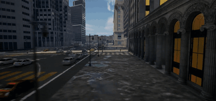

# Vehicle Behavior Blueprint

The **Vehicle Behavior** Blueprint is a custom, parameterized Unreal Engine Blueprint (VehicleAI) that populates a world with autonomous vehicle traffic that drives and reacts at runtime. This page covers how to download it and use it in your own Unreal project.

!!! note "Work in progress"
    The downloadable Blueprint package and full parameter reference are being finalized. This page is a placeholder — the download link and detailed usage guide will land here soon.

## Download

<!-- TODO: replace with the actual release asset link once published -->
*Download link coming soon.* The Vehicle Behavior Blueprint will be published as a downloadable Unreal asset package on the [HERCULES releases page](https://github.com/lunarlab-gatech/HERCULES/releases).

## Install into your Unreal project

1. Download and unzip the Blueprint package.
2. Copy the provided `Content/` assets into your Unreal project's `Content/` directory.
3. Restart the Unreal Editor so the assets are registered.

## Usage

1. Place the traffic / vehicle behavior Blueprint into your level along the road network.
2. Configure traffic density, speeds, and routing behavior.
3. Play / run the simulation — the vehicles drive through the world and are observable by all robots' sensors.

## Parameters

<!-- TODO: fill in the real exposed parameters -->
| Parameter | Description | Default |
|---|---|---|
| Traffic density | How many vehicles | — |
| Speed range | Vehicle speeds | — |
| Routes | Road network the vehicles follow | — |

See the [Dynamic Environmental Phenomena](dynamic_phenomena.md) overview and the [Environments](index.md#environments) for these agents in context.
