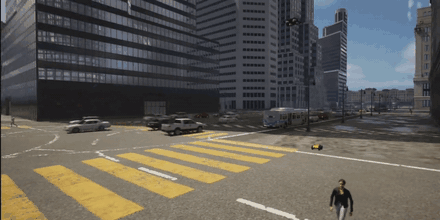
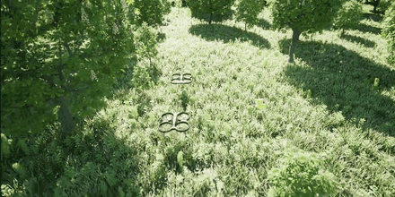

# Heterogeneous UAV–UGV Autonomy

HERCULES re-architects the AirSim / Cosys-AirSim `SimMode` layer to enable **concurrent operation of unmanned aerial vehicles (UAVs) and unmanned ground vehicles (UGVs) within a single simulation session**. In stock AirSim, each session is restricted to a single vehicle type because of a physics-engine conflict between the multirotor and ground-vehicle models; HERCULES resolves this so that drones and Huskies can be spawned, controlled, and logged together in the same world.

## Unified autonomy stack

On top of concurrent operation, HERCULES adds the components needed to make large-scale outdoor heterogeneous experiments practical:

- **Unified waypoint-level command interface.** UGVs are commanded through the same high-level waypoint interface as UAVs, so exploration and coordination research can target both platforms with one API.
- **Autonomous waypoint-tracking UGV controller.** A novel controller drives the ground vehicles along generated trajectories, mirroring the UAV interface.
- **End-to-end planning pipeline.** Offline trajectory generation produces kinodynamically feasible motion for both platforms, including complementary **coverage** and **leader–follower** trajectory patterns for dataset collection.
- **Coordinated multi-robot sensor logging.** Synchronized, per-robot logging of all sensor streams across the team.

## Vehicles

HERCULES uses the multirotor drone model for UAVs and the [skid-steer vehicle](skid_steer_vehicle.md) model (ClearPath Husky) for UGVs. See [Multiple Vehicles](multi_vehicle.md) and [Settings](settings.md) for how to declare a mixed team, and the [ROS 2 wrapper](ros_cplusplus.md) for integrating your own planners and estimators.

!!! note
    The heterogeneous stack builds on the vehicle and SimMode infrastructure inherited from Cosys-AirSim. See the [Skid Steer Vehicles](skid_steer_vehicle.md) and [Car Mode](using_car.md) pages for the underlying ground-vehicle models.
