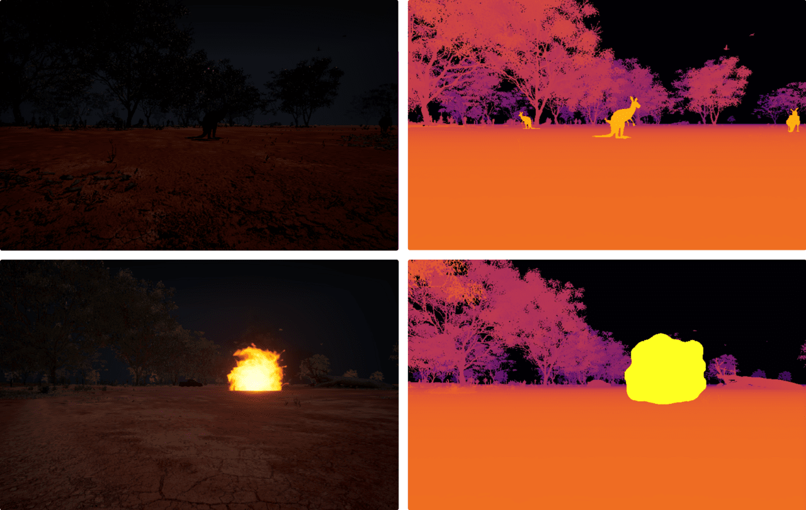

# LWIR Thermal Camera

HERCULES adds a **physics-based long-wave infrared (LWIR) thermal camera** that is not present in Cosys-AirSim. Rather than false-coloring an RGB image, it renders apparent temperature from **Planck-law spectral radiance**, so warm bodies (wildlife, people, vehicles, fire) stand out against a cooler background.



## What it models

- Per-object thermal emission integrated over the LWIR band using the Planck radiation law.
- Distinct thermal signatures for warm agents (wildlife, MetaHuman pedestrians, vehicles) versus the environment.
- Pairs naturally with the [dynamic phenomena](dynamic_phenomena.md) (e.g. wildfire) and the [night-vision camera](night_vision.md) for low-light and search-and-rescue scenarios.

## Usage

The LWIR camera is exposed as camera image type **`ThermalIR = 11`**, synthesized server-side from Segmentation + DepthPlanar captures rendered in the same `simGetImages` batch (same frame, lockstep-safe) and captured through the same [Image APIs](image_apis.md) as the RGB, depth, and segmentation streams:

```python
responses = client.simGetImages([
    airsim.ImageRequest("front_center", airsim.ImageType.ThermalIR, False, False)
])
```

Object temperatures come from mesh-name keyword classification plus optional per-object `Overrides` in the [settings file](settings.md). See **[Synthetic IR / NVG Cameras](synthetic_cameras.md)** for setup requirements, the keyword table, the settings reference, and troubleshooting (including "object not showing up"). See [Sensors](sensors.md) for the full sensor suite and the [Infrared Camera](InfraredCamera.md) page for the related inherited thermal tooling.
