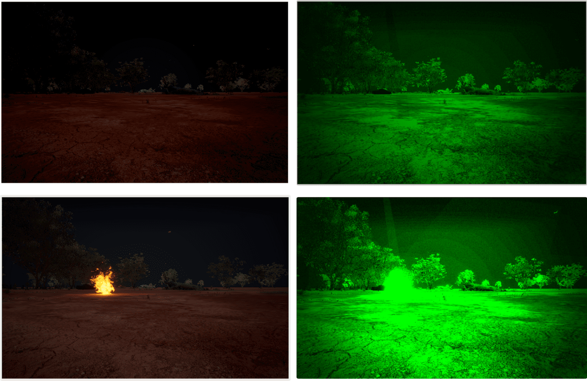

# Night-Vision Camera

HERCULES adds a configurable **night-vision (NVG) camera** with an empirical photometric transfer that reproduces the characteristic low-light, image-intensified look — enabling nighttime perception and exploration experiments.

## What it models

- Empirical photometric transfer mapping scene luminance to the intensified night-vision response.
- Configurable low-light behavior for nighttime flights and drives.
- Complements the [LWIR thermal camera](lwir_camera.md) for combined thermal + low-light sensing, and the [dynamic phenomena](dynamic_phenomena.md) for scenarios such as fires observed at night.

## Usage

The night-vision camera is captured through the standard [Image APIs](image_apis.md) and configured via the [settings file](settings.md). See [Sensors](sensors.md) for the complete sensor list and [Camera Views](camera_views.md) for viewport configuration.
